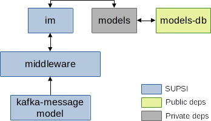

# Architecture

Within the Better Factory project, the *im* is deployed as part of the Cognitive Human Robot Interaction (C-HRI) scenario.
The deployment is based on Docker Compose, and the set of initialized components is depicted in the picture here below:

The blue-colored components represent the core components for which SUPSI provides and maintains a Docker image; the other components (grey- and green-colored) represent dependencies that are provided as Docker images by third parties.

!!! info
    In this deployment version, the only external dependencies that is available only in a private registry is *models*. The *models* image is provided and maintained by Holonix (HOL) within the Better Factory project.

The *im* component allows users to easily define intervention rules to orchestrate a production system. The component monitors the status of the worker-factory ecosystem in real-time, by elaborating data from sensors, machines, workers monitoring systems, ERP, and more. The set of intervention rules are known to the *im*, which decides which is the best one to trigger.

## Dependencies

### middleware

The image is based on the [fast-data-dev (v2.6.2)](https://github.com/lensesio/fast-data-dev/tree/fdd/2.6.2) project by Lenses.io and runs a full fledged Kafka installation (including extra services, e.g., UIs).

In addition, the Schema Registry is automatically populated with schemas available under the `/schemas` directory. In our deployment, the `/schemas` directory is read from the *kafka-message-model* component.

The middleware is run in secure mode and can be accessed at [localhost:3040](localhost:3040) (credentials are stored in the docker-compose file).

### kafka-message-model
This component embeds the data model shared within the Better Factory project. The data model is automatically uploaded to the Schema Registry available within the *middleware*.

### models
The *models* component exposes a REST API to access the data model shared among all the components involved in the C-HRI scenario. The API is accessed by both the *fams* and *im* components to fetch information about workers and other factory elements.

!!! important
    This image is available in a private Docker registry hosted at GitLab. Please ask HOLONIX to get access to this image.

### models-db
The *models-db* component runs an official MySql docker image (v5.7).
