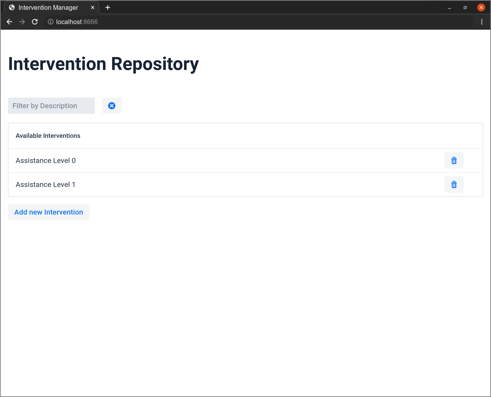
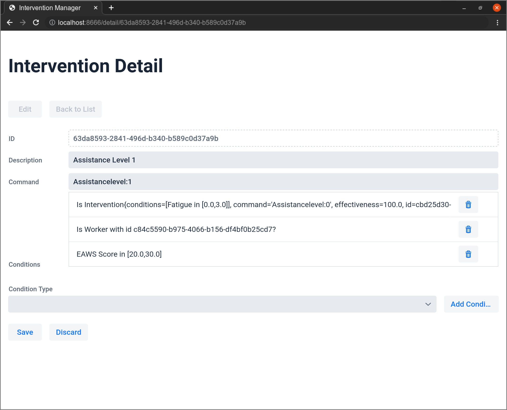
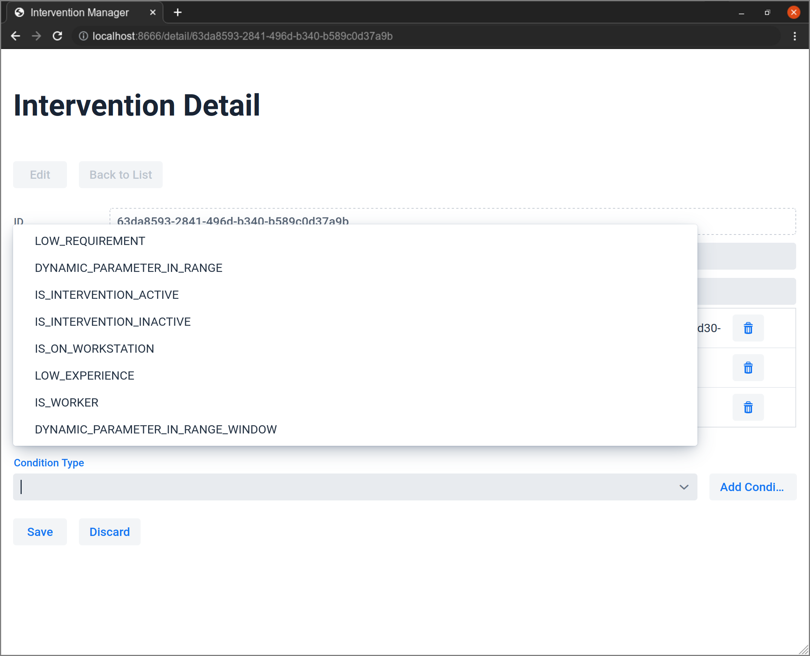
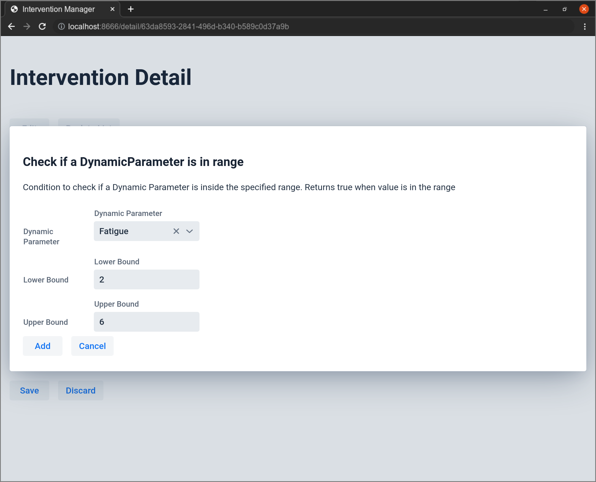
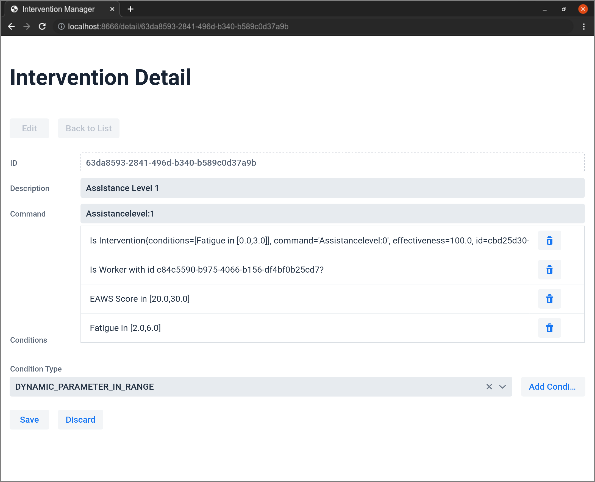
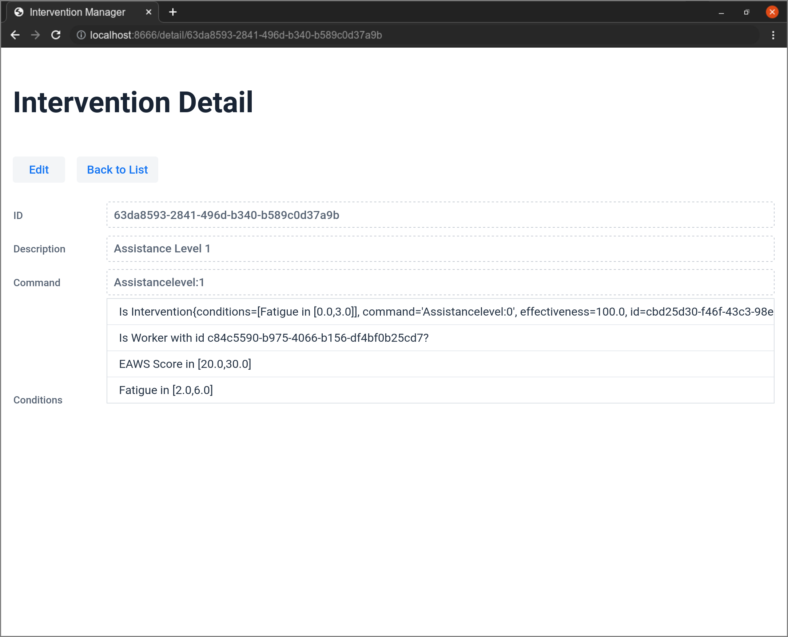

# User Manual

!!! info

    We assume the IM having its default configuration, thus being available on
    **port 8666** of the hosting machine.

## Management of the Interventions

This section introduces the reader to the GUI of the IM, with a focus on
the management of the intervention rules. The management activity covers
the following actions:

-   **VIEW**: List existing interventions, with their details
-   **CREATE**: Add new interventions to the IM
-   **DELETE**: Remove existing interventions from the IM
-   **EDIT**: Modify existing interventions. Specifically, an intervention
    can be modified by:
    -   **C-ADD**: Adding new conditions
    -   **C-REMOVE**: Removing some conditions

In the following, some *How-to*s are provided to help the reader in dealing with
the basic management of interventions through the IM GUI.

### How-to: VIEW

Head to [localhost:8666](http://localhost:8666) from your Web browser.
The browser will display the IM main page, as follows:

The main page lists all the available interventions.

!!! important

    Interventions listed on the main page are all active.

### How-to: CREATE

From the main, click the **Add new Intervention** at the bottom of the
intervention list.

A new default intervention named *NEW INTERVENTION* is added to the list.

See the [How-to: EDIT](#how-to-edit) section to know how to customize the
generated intervention.

### How-to: EDIT

To edit an intervention, click on its description from the list of interventions
in the main page.

A new page appears, showing the details of the selected intervention.

Click on the **Edit** button to enter the edit mode and make the fields
editable.

#### How-to: C-ADD
To add a condition, start by selecting the type of condition.

The available types of condition are as follows:

`LOW_REQUIREMENT`

:   Condition to check if the minimum requirements are met. Returns true when
the job has higher requirements than the workers has traits.

`DYNAMIC_PARAMETER_IN_RANGE`

:   Condition to check if a Dynamic Parameter is inside the specified range.
Returns true when value is in the range.

`IS_INTERVENTION_ACTIVE`

:   Condition to check if the specified intervention is active for the inspected
worker. Returns true when the intervention is active.

`IS_INTERVENTION_INACTIVE`

:   Condition to check if the specified intervention is not active for the
inspected worker. Returns true when the intervention is not active.

`IS_ON_WORKSTATION`

:   Condition to check if a worker is assigned to a workstation. Returns true
when the worker is assigned to the specified workstation.

`LOW_EXPERIENCE`

:   Condition to check if the worker has enough experience to carry out this
work. Parameter is the minimum number of times the job has been executed.

`IS_WORKER`

:   Condition to check if a worker is a specific person Returns true when the
worker si the specified person (based on the id).

`DYNAMIC_PARAMETER_IN_RANGE_WINDOW`

:   Condition to check if a Dynamic Parameter is inside the specified range for
the given window and with the specified aggregation function. Returns true when
value is in the range.

Depending on the chosen condition, a new window may pop-up, asking for specific
information. The following figure depicts the condition parameters needed for
the DYNAMIC_PARAMETER_IN_RANGE type.

Click the **Add** button to update the intervention with the new condition.

!!! warning

    Adding a new condition will trigger a compatibility check. You may be alerted
    that "*The selected condition is incompatible with the other declared for
    the current intervention*".

The updated status of the intervention is then available to the user.

When satisfied with the set conditions, click the **Save** button to persist the
modified intervention.

The updated details will be shown to the user.
To know how to delete an existing condition, see the [How-to: C-REMOVE](#how-to-c-remove)
section.

#### How-to: C-REMOVE

When you are in edit mode (checkout section [How-to: EDIT](#how-to-edit) to know how to enter this mode), click the "Trash Bin" icon next the condition to remove.

### How-to: DELETE

To delete an intervention, click the "Trash Bin" icon next the intervention to remove from the list of interventions on the main page.

